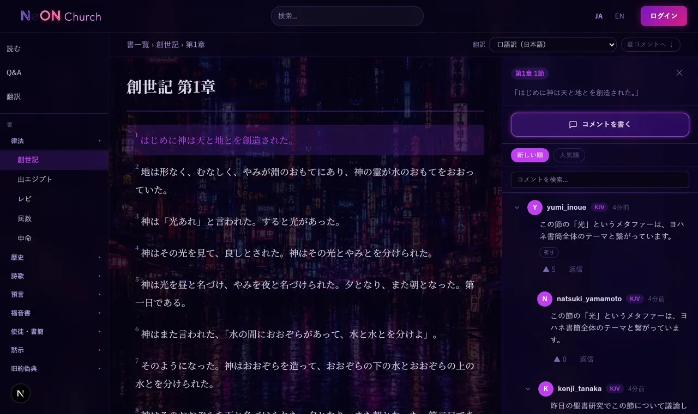
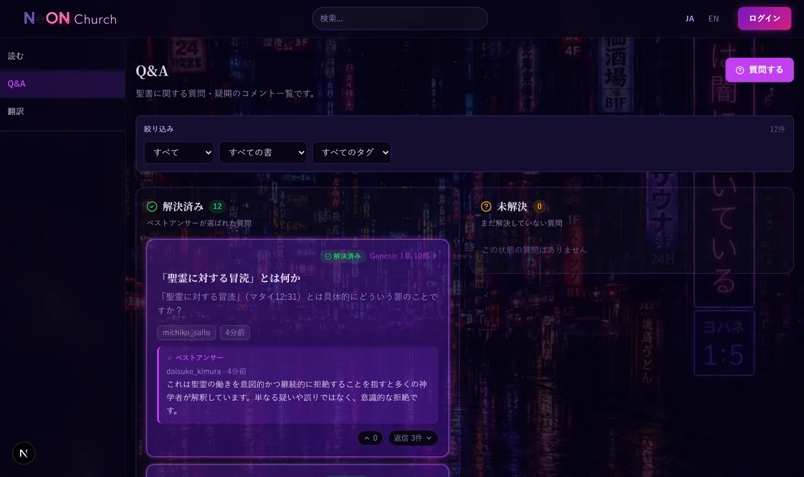
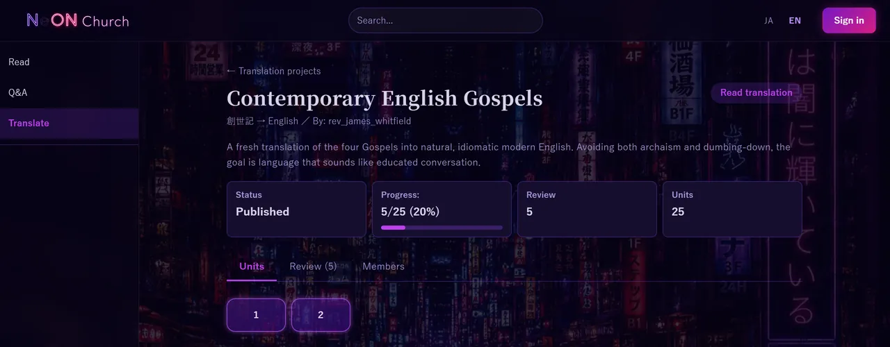

<div align="center">


# NeON Church

**Not a church as an institution, but an open field where texts and interpretations intersect.**

[](https://github.com/yuki-matsuno-525/NeON-Church/actions/workflows/frontend.yml)
[](https://github.com/yuki-matsuno-525/NeON-Church/actions/workflows/backend.yml)
[](https://github.com/yuki-matsuno-525/NeON-Church/actions/workflows/e2e.yml)


**[Live: neon-church.com](https://neon-church.com)** · [コードベース解説](docs/codebase-guide.md)

</div>

---

NeON Church reimagines Christianity not as a single fixed authority, but as an open field where multiple texts, interpretations, histories, and fragments connect. It draws on Kanzo Uchimura's Non-Church Christianity and a "database-like" reading of faith after postmodernism, shedding light on texts placed outside the canon and interpretations long marginalized. Every text is treated as equal — no second-class scriptures. Here you can read, annotate, discuss, and collaboratively translate biblical texts (canon, Apocrypha, and Pseudepigrapha) together.

制度としての教会ではなく、テキストと解釈が交差する「開かれた場」。キリスト教を、ひとつの固定された権威としてではなく、複数のテキスト・解釈・歴史・断片が接続される場として捉え直す試み。正典から外典・偽書まで、あらゆるテキストをオンラインで読み、コメント・議論し、共同で翻訳できる Web サービス。

<div align="center">

<p><sub>節を選ぶとコメントパネルが開く（創世記 第1章）</sub></p>
</div>

<table>
<tr>
<td width="50%"></td>
<td width="50%"></td>
</tr>
<tr>
<td align="center"><sub>Q&A — 解決済み / 未解決の2列ボード</sub></td>
<td align="center"><sub>共同翻訳プロジェクト</sub></td>
</tr>
</table>

## 機能

- **聖書閲覧** — 書 → 章 → 節の階層ナビゲーション。
- **コメント** — 節・章・書それぞれにコメント投稿。ツリー返信・Upvote・編集・削除・タグ付け。
- **Q&A** — `is_qa` フラグ付きコメントを一覧表示。ベストアンサー設定・解決済みフィルタ付き。
- **全文検索** — 節テキスト・コメント本文・書名を横断検索。
- **お気に入り** — 節・コメントをブックマーク。プロフィールページで一覧表示。
- **通知** — コメントへの返信時に通知。未読バッジ表示。
- **読書継続** — 前回読んだ節を記録し、続きから読む。
- **共同翻訳** — 翻訳プロジェクトを立ち上げ、節単位で担当者を割り当てて翻訳できる。
- **プロフィール** — アバター画像・自己紹介・コメント履歴・お気に入り一覧。他ユーザーのプロフィールも公開。

## 技術スタック

| レイヤー | 技術 |
|---------|------|
| フロントエンド | Next.js (App Router) |
| バックエンド | Django REST Framework |
| データベース | PostgreSQL |
| 認証 | JWT + HTTP-only Cookie (djangorestframework-simplejwt) |
| エラー監視 | Sentry |
| OpenAPI | drf-spectacular |
| テスト (BE) | pytest / pytest-django |
| テスト (FE) | Jest / React Testing Library |

## デプロイ構成

| サービス | プラットフォーム |
|---------|----------------|
| フロントエンド | Vercel |
| バックエンド | Render |
| データベース | Render PostgreSQL |
| Uptime 監視 | Better Stack |
| CI/CD | GitHub Actions |

## クイックスタート

前提: Docker & Docker Compose、Git。

```bash
git clone https://github.com/yuki-matsuno-525/NeON-Church.git
cd NeON-Church
cp .env.example .env          # 内容は基本そのままで動作する
docker-compose up --build     # 初回はビルドに数分かかる
```

起動後:

| | URL |
|---|---|
| フロントエンド | http://localhost:3000 |
| バックエンド API | http://localhost:8000 |
| OpenAPI スキーマ | http://localhost:8000/api/schema/swagger-ui/ |

<details>
<summary><b>聖書テキストのインポート</b></summary>

<br/>

```bash
# 口語訳（4福音書）をインポート
docker-compose exec backend python manage.py import_gospel

# KJV（英語）をインポート
docker-compose exec backend python manage.py import_kjv

# Nestle 1904（ギリシャ語原文・4福音書）をインポート
docker-compose exec backend python manage.py import_greek

# 外典・偽典（エノク書・マリア/ペテロ/ユダ/トマス幼児福音書・アダムとエバの生涯）を一括投入
docker-compose exec backend python manage.py import_others
```

テキストデータは `text/` ディレクトリに配置してある。

### 外典・偽典の取り込みパイプライン

外典・偽典は「HTML → 正規化JSON → DB」の 2 段で取り込む。

1. パース（ローカルのみ）: `bible/importers/` の書ごとのパーサが HTML を正規化 JSON に変換する。
   確認用に `python -m bible.importers.cli all <book> <html>` で JSON とプレビューを出力できる。
2. 投入: 確認済み JSON を `backend/bible/seed/others/` にコミットし、`import_others` が全 JSON を
   まとめて DB へ投入する（冪等）。

本番（Render）のイメージには `text/` が含まれないため、HTML ではなく `seed/others/` の
確定 JSON を同梱し、`import_others` 一発で投入する。**デプロイ後に Render のシェルで実行**:

```bash
python manage.py migrate        # 未適用なら
python manage.py import_others  # 外典・偽典を投入（冪等。何度実行しても安全）
```

</details>

<details>
<summary><b>シードデータの投入</b></summary>

<br/>

実際にサービスが使われた状態を再現するための豊富なサンプルデータを投入できる。

**Docker 環境の場合:**

```bash
# シードを投入（既存データに追加）
docker-compose exec backend python manage.py seed

# 既存データを削除してからシードを投入（クリーンな状態にしたい場合）
docker-compose exec backend python manage.py seed --clear
```

**Docker なし（SQLite E2E 環境）の場合:**

```bash
cd backend
DJANGO_SETTINGS_MODULE=config.settings.e2e python manage.py seed --clear
```

投入されるデータの内訳:

| データ | 件数 |
|--------|------|
| ユーザー | 15 人（多様な自己紹介・役割） |
| コメント | 200+ 件（節・章・書レベル、返信ツリー depth 3、Q&A＋ベストアンサー） |
| 投票 | 200+ 件 |
| ブックマーク | 100+ 件（節・コメント両方） |
| 通知 | 100+ 件（返信・いいね両タイプ） |
| 読書進捗 | 40+ 件（各ユーザーが複数書籍） |
| 翻訳プロジェクト | 3 件（draft / active / published 各 1 件） |
| 翻訳ユニット | 60 件（todo / in_progress / review / done 混在） |
| 翻訳コメント | 20+ 件 |

> シードユーザーのパスワードはすべて `Seed@pass123`。

</details>

<details>
<summary><b>管理ユーザー・コンテナの停止 / リセット</b></summary>

<br/>

```bash
# 管理ユーザーの作成（Django Admin: http://localhost:8000/admin/）
docker-compose exec backend python manage.py createsuperuser

# 停止
docker-compose down

# DB ボリュームごとリセット（全データ削除）
docker-compose down -v
```

</details>

<details>
<summary><b>テスト</b></summary>

<br/>

```bash
# バックエンド
docker-compose exec backend pytest

# フロントエンド
cd frontend
npm test
```

</details>

<details>
<summary><b>環境変数</b></summary>

<br/>

`.env.example` を参照。主要な変数:

| 変数名 | 説明 |
|-------|------|
| `DJANGO_SECRET_KEY` | Django シークレットキー（本番では長いランダム文字列に変更） |
| `DJANGO_DEBUG` | `True`（開発）/ `False`（本番） |
| `DJANGO_ALLOWED_HOSTS` | 許可するホスト（カンマ区切り） |
| `CSRF_TRUSTED_ORIGINS` | CSRF を許可するオリジン |
| `POSTGRES_*` | PostgreSQL 接続情報 |
| `NEXT_PUBLIC_API_BASE_URL` | フロントエンドからのバックエンド API URL |
| `NEXT_PUBLIC_SITE_URL` | 公開ドメイン（OGP の metadataBase に使用） |
| `GOOGLE_CLIENT_ID/SECRET` | Google OAuth 認証情報 |
| `GITHUB_CLIENT_ID/SECRET` | GitHub OAuth 認証情報 |
| `NEXT_PUBLIC_OAUTH_*_ENABLED` | OAuth ボタンの表示フラグ |
| `SENTRY_DSN` | Sentry DSN（省略可） |

</details>

<details>
<summary><b>API 概要</b></summary>

<br/>

ベース URL: `http://localhost:8000/api/`

| エンドポイント | 説明 |
|--------------|------|
| `GET /books/` | 書一覧 |
| `GET /books/{id}/chapters/` | 章一覧 |
| `GET /chapters/{id}/verses/` | 節一覧 |
| `GET/POST /comments/` | コメント取得・投稿 |
| `POST /comments/{id}/upvote/` | Upvote |
| `GET/POST /bookmarks/` | お気に入り一覧・登録 |
| `GET /notifications/` | 通知一覧 |
| `GET /search/?q=...` | 全文検索 |
| `GET /qa/` | Q&A コメント一覧 |
| `GET/POST /translations/` | 翻訳プロジェクト一覧・作成 |
| `POST /auth/register/` | ユーザー登録 |
| `POST /auth/login/` | ログイン |
| `POST /auth/logout/` | ログアウト |
| `GET /auth/me/` | ログイン中ユーザー情報 |
| `GET /users/{username}/` | 他ユーザープロフィール |

完全なスキーマは `/api/schema/swagger-ui/` で確認できる。

</details>

<details>
<summary><b>プロジェクト構成</b></summary>

<br/>

```
NeON-Church/
├── backend/             # Django REST Framework
│   ├── bible/           # 書・章・節モデル、検索
│   ├── comments/        # コメント・タグ・Upvote・Q&A
│   ├── bookmarks/       # お気に入り
│   ├── notifications/   # 通知
│   ├── reading_progress/# 読書継続
│   ├── translations/    # 共同翻訳プロジェクト
│   ├── users/           # 認証・プロフィール
│   ├── config/          # Django 設定・URL ルーティング
│   └── tests/           # テストスイート
├── frontend/            # Next.js
│   └── src/
│       ├── app/         # App Router ページ
│       ├── components/  # UI コンポーネント
│       ├── contexts/    # AuthContext・LanguageContext・NotificationContext
│       ├── hooks/       # useComments 等カスタムフック
│       └── lib/         # API クライアント・型定義
├── text/                # 聖書テキストデータ（インポート用）
├── plan/                # 設計ドキュメント
│   └── pre-launch-checklist.md # 公開前チェックリスト
└── docker-compose.yml
```

</details>

<details>
<summary><b>認証フロー</b></summary>

<br/>

1. `POST /api/auth/login/` でアクセストークン（20分）とリフレッシュトークン（20日）を HTTP-only Cookie にセット
2. 以降のリクエストは Cookie を自動送信
3. アクセストークン期限切れ時は自動でリフレッシュ（refresh token rotation）
4. ログアウト時は Cookie 削除 + リフレッシュトークン失効

</details>

## ライセンス

Private
