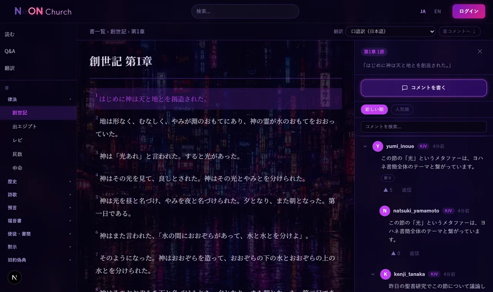
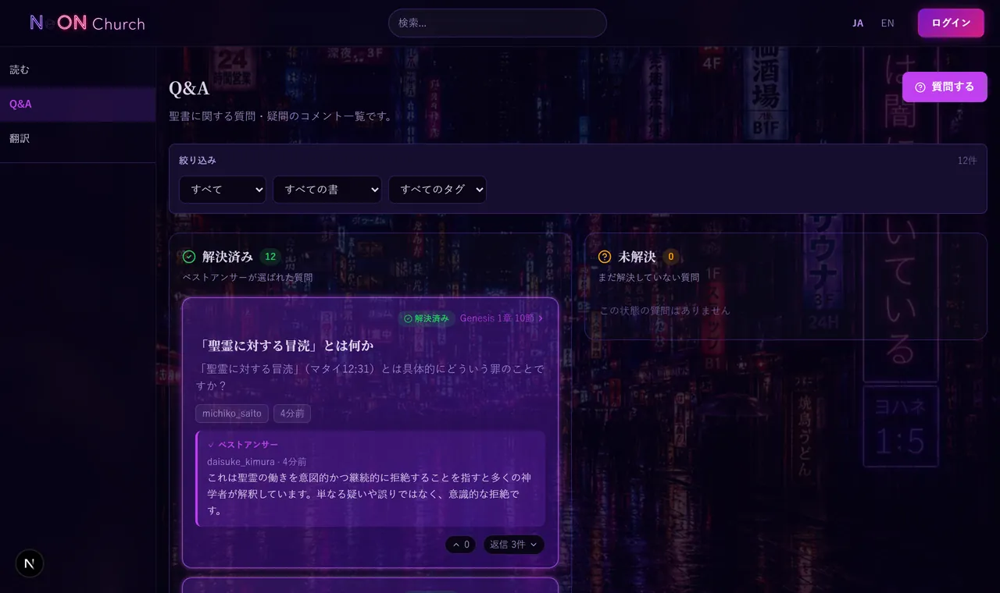
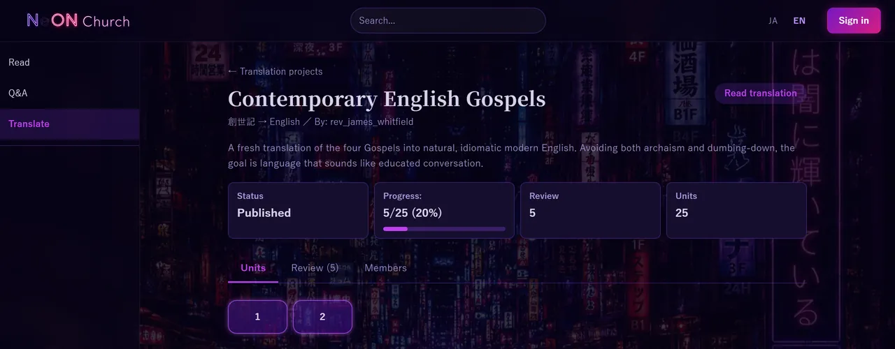

<div align="center">


# NeON Church

**Not a church as an institution, but an open field where texts and interpretations intersect.**

[](https://github.com/yuki-matsuno-525/NeON-Church/actions/workflows/frontend.yml)
[](https://github.com/yuki-matsuno-525/NeON-Church/actions/workflows/backend.yml)
[](https://github.com/yuki-matsuno-525/NeON-Church/actions/workflows/e2e.yml)


**[Live: neon-church.com](https://neon-church.com)** · [Codebase Guide (in Japanese)](docs/codebase-guide.md)

</div>

---

NeON Church reimagines Christianity not as a single fixed authority, but as an open field where multiple texts, interpretations, histories, and fragments connect. It draws on Kanzo Uchimura's Non-Church Christianity and a "database-like" reading of faith after postmodernism, shedding light on texts placed outside the canon and interpretations long marginalized. Every text is treated as equal — no second-class scriptures. Here you can read, annotate, discuss, and collaboratively translate biblical texts (canon, Apocrypha, and Pseudepigrapha) together.

<div align="center">

<p><sub>Selecting a verse opens the comment panel — John 1 in the Textus Receptus (Greek)</sub></p>
</div>

<table>
<tr>
<td width="50%"></td>
<td width="50%"></td>
</tr>
<tr>
<td align="center"><sub>Q&A — a two-column board of answered / unanswered</sub></td>
<td align="center"><sub>A collaborative translation project</sub></td>
</tr>
</table>

> The interface ships in both English and Japanese — switch with the JA / EN toggle in the header.

## Features

- **Scripture reading** — Hierarchical navigation: book → chapter → verse.
- **Comments** — Post on a verse, a chapter, or a whole book. Threaded replies, upvotes, editing, deletion, and tagging.
- **Q&A** — Comments flagged with `is_qa` are listed together, with best-answer selection and a resolved filter.
- **Full-text search** — Searches across verse text, comment bodies, and book names.
- **Bookmarks** — Bookmark verses and comments; browse them from your profile.
- **Notifications** — Get notified when someone replies to your comment, with an unread badge.
- **Reading progress** — Remembers the last verse you read so you can pick up where you left off.
- **Collaborative translation** — Start a translation project and assign translators verse by verse.
- **Profiles** — Avatar, bio, comment history, and bookmarks. Other users' profiles are public too.

## Tech stack

| Layer | Technology |
|---------|------|
| Frontend | Next.js (App Router) |
| Backend | Django REST Framework |
| Database | PostgreSQL |
| Auth | JWT + HTTP-only cookies (djangorestframework-simplejwt) |
| Error monitoring | Sentry |
| OpenAPI | drf-spectacular |
| Tests (BE) | pytest / pytest-django |
| Tests (FE) | Jest / React Testing Library |

## Deployment

| Service | Platform |
|---------|----------------|
| Frontend | Vercel |
| Backend | Render |
| Database | Render PostgreSQL |
| Uptime monitoring | Better Stack |
| CI/CD | GitHub Actions |

## Quick start

Prerequisites: Docker & Docker Compose, Git.

```bash
git clone https://github.com/yuki-matsuno-525/NeON-Church.git
cd NeON-Church
cp .env.example .env          # the defaults work as-is
docker-compose up --build     # the first build takes a few minutes
```

Once it is up:

| | URL |
|---|---|
| Frontend | http://localhost:3000 |
| Backend API | http://localhost:8000 |
| OpenAPI schema | http://localhost:8000/api/schema/swagger-ui/ |

<details>
<summary><b>Importing scripture texts</b></summary>

<br/>

```bash
# Kougo-yaku (the four Gospels, Japanese)
docker-compose exec backend python manage.py import_gospel

# KJV (English)
docker-compose exec backend python manage.py import_kjv

# Nestle 1904 (Greek source text, the four Gospels)
docker-compose exec backend python manage.py import_greek

# Apocrypha and Pseudepigrapha in one go
# (Enoch, the Gospels of Mary / Peter / Judas, the Infancy Gospel of Thomas, the Life of Adam and Eve)
docker-compose exec backend python manage.py import_others
```

Text data lives in the `text/` directory.

### The Apocrypha / Pseudepigrapha import pipeline

These texts are imported in two stages: HTML → normalized JSON → database.

1. Parse (local only): a per-book parser under `bible/importers/` converts HTML into normalized JSON.
   Run `python -m bible.importers.cli all <book> <html>` to inspect the JSON and a preview.
2. Load: commit the reviewed JSON to `backend/bible/seed/others/`, and `import_others` loads every
   JSON file into the database (idempotent).

The production image on Render does not include `text/`, so the finalized JSON under `seed/others/`
ships with the image instead of the HTML, and `import_others` loads it in one shot.
**Run this in the Render shell after deploying:**

```bash
python manage.py migrate        # if there are unapplied migrations
python manage.py import_others  # loads the texts (idempotent — safe to re-run)
```

</details>

<details>
<summary><b>Loading seed data</b></summary>

<br/>

Seed data reproduces what the service looks like once people are actually using it.
Everything comes from one command, `seed_demo`, which mixes Japanese and English users.

**With Docker:**

```bash
# Wipe existing user data and load the full-size seed (a few minutes)
docker-compose exec backend python manage.py seed_demo --wipe

# A smaller set, enough to click through every screen
docker-compose exec backend python manage.py seed_demo --wipe --scale large
```

**Without Docker (SQLite E2E setup):**

```bash
cd backend
DJANGO_SETTINGS_MODULE=config.settings.e2e python manage.py seed_demo --wipe --scale small
```

`--wipe` removes every non-staff user and everything people created (comments, Q&A,
articles, plans, translation projects, bookmarks, notifications). Scripture itself
(`CanonicalBook` / `Book` / `Chapter` / `Verse`) is never touched. Without `--wipe` the
command refuses to run on a database that already has data, so it cannot double up.

What `--scale xl` (the default) creates:

| Data | Count |
|--------|------|
| Users | 220 (half Japanese, half English, varied bios) |
| Comments | 25,000+ (verse / chapter / book level, reply trees of depth 5, soft deletes) |
| Votes | 60,000+ |
| Q&A | 400 questions / 2,500+ answers (half solved, one question with 80 answers) |
| Articles | 400 (public / unlisted / draft, every citation form including a broken one) |
| Article comments | 3,000+ (one article carries 120) |
| Plans | 120 (3 to 365 days, canon and apocrypha mixed, subscriptions and progress) |
| Translation projects | 40 (all statuses, all membership states, all unit states) |
| Bookmarks | 5,000+ (books, chapters, verses, comments, translation projects) |
| Notifications | 15,000+ (reply / upvote / mention, read and unread) |
| Reports | 300 (comments, questions and answers) |

> The command prints one shared password for the seeded users when it finishes.
> It also creates an admin account if the database has no superuser yet, and prints
> that password once.

</details>

<details>
<summary><b>Admin user, stopping and resetting containers</b></summary>

<br/>

```bash
# Create an admin user (Django Admin: http://localhost:8000/admin/)
docker-compose exec backend python manage.py createsuperuser

# Stop
docker-compose down

# Reset, dropping the database volume (deletes all data)
docker-compose down -v
```

</details>

<details>
<summary><b>Tests</b></summary>

<br/>

```bash
# Backend
docker-compose exec backend pytest

# Frontend
cd frontend
npm test
```

</details>

<details>
<summary><b>Environment variables</b></summary>

<br/>

See `.env.example`. The main ones:

| Variable | Description |
|-------|------|
| `DJANGO_SECRET_KEY` | Django secret key (use a long random string in production) |
| `DJANGO_DEBUG` | `True` (development) / `False` (production) |
| `DJANGO_ALLOWED_HOSTS` | Allowed hosts (comma-separated) |
| `CSRF_TRUSTED_ORIGINS` | Origins trusted for CSRF |
| `POSTGRES_*` | PostgreSQL connection settings |
| `NEXT_PUBLIC_API_BASE_URL` | Backend API URL used by the frontend |
| `NEXT_PUBLIC_SITE_URL` | Public domain (used as the OGP `metadataBase`) |
| `NEXT_ALLOWED_DEV_ORIGINS` | Extra comma-separated hosts allowed to load the Next.js dev UI (local browser testing only) |
| `GOOGLE_CLIENT_ID/SECRET` | Google OAuth credentials |
| `GITHUB_CLIENT_ID/SECRET` | GitHub OAuth credentials |
| `EMAIL_HOST/PORT/USE_TLS` | SMTP connection used for password reset and feedback |
| `EMAIL_HOST_USER/PASSWORD` | SMTP credentials |
| `DEFAULT_FROM_EMAIL` | Sender address for service emails |
| `FEEDBACK_EMAIL` | Recipient for feedback submissions |
| `NEXT_PUBLIC_OAUTH_*_ENABLED` | Feature flags for the OAuth buttons |
| `SENTRY_DSN` | Sentry DSN (optional) |

</details>

<details>
<summary><b>API overview</b></summary>

<br/>

Base URL: `http://localhost:8000/api/`

| Endpoint | Description |
|--------------|------|
| `GET /books/` | List books |
| `GET /books/{id}/chapters/` | List chapters |
| `GET /chapters/{id}/verses/` | List verses |
| `GET/POST /comments/` | Read and post comments |
| `POST /comments/{id}/upvote/` | Upvote |
| `GET/POST /bookmarks/` | List and create bookmarks |
| `GET /notifications/` | List notifications |
| `GET /search/?q=...` | Full-text search |
| `GET /qa/` | List Q&A comments |
| `GET/POST /translations/` | List and create translation projects |
| `POST /auth/register/` | Register |
| `POST /auth/login/` | Log in |
| `POST /auth/logout/` | Log out |
| `GET /auth/me/` | Current user |
| `GET /users/{username}/` | Another user's profile |

The full schema is available at `/api/schema/swagger-ui/`.

</details>

<details>
<summary><b>Project layout</b></summary>

<br/>

```
NeON-Church/
├── backend/             # Django REST Framework
│   ├── bible/           # Book / chapter / verse models, search
│   ├── comments/        # Comments, tags, upvotes, Q&A
│   ├── bookmarks/       # Bookmarks
│   ├── notifications/   # Notifications
│   ├── reading_progress/# Reading progress
│   ├── translations/    # Collaborative translation projects
│   ├── users/           # Auth and profiles
│   ├── config/          # Django settings and URL routing
│   └── tests/           # Test suite
├── frontend/            # Next.js
│   └── src/
│       ├── app/         # App Router pages
│       ├── components/  # UI components
│       ├── contexts/    # AuthContext, LanguageContext, NotificationContext
│       ├── hooks/       # Custom hooks such as useComments
│       └── lib/         # API client and type definitions
├── text/                # Scripture text data (for importing)
├── plan/                # Design documents
│   └── pre-launch-checklist.md
└── docker-compose.yml
```

</details>

<details>
<summary><b>Authentication flow</b></summary>

<br/>

1. `POST /api/auth/login/` sets an access token (20 minutes) and a refresh token (20 days) as HTTP-only cookies
2. Subsequent requests send the cookies automatically
3. An expired access token is refreshed automatically (with refresh token rotation)
4. Logging out clears the cookies and revokes the refresh token

</details>

## License

Private
