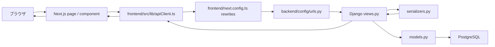
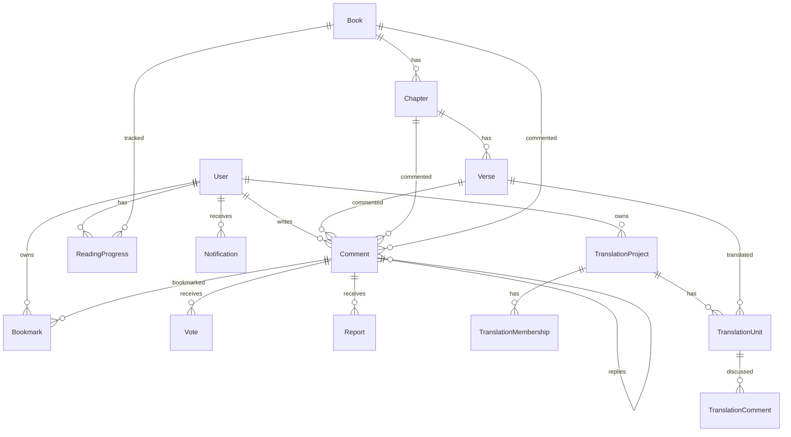

# NeON Church コードベース学習ガイド

このドキュメントは、Claude Code などで作られたコードを「自分で読める・直せる」状態に近づけるための地図です。細かい実装を全部暗記するよりも、まずは「どの機能がどこにあり、画面から API、DB までどう流れるか」を掴むことを目的にしています。

作成日: 2026-05-24

## まず全体像

NeON Church は、聖書本文を読みながらコメント、Q&A、ブックマーク、読書進捗、共同翻訳を扱う Web アプリです。

技術構成は大きく 3 層です。

| 層 | 場所 | 主な役割 |
| --- | --- | --- |
| フロントエンド | `frontend/` | Next.js App Router。画面表示、入力フォーム、API 呼び出し |
| バックエンド | `backend/` | Django REST Framework。API、認証、DB 操作 |
| DB | PostgreSQL | Docker Compose で起動。Django models がテーブル定義 |

開発時の基本的な流れは、ブラウザで Next.js のページを開き、`frontend/src/lib/apiClient.ts` の関数が `/api/...` にリクエストし、Next.js の rewrites が Django に転送し、Django の view が model を読んだり保存したりして JSON を返します。



## 最初に読むファイル

最短で全体を掴むなら、この順番がおすすめです。

| 順番 | ファイル | 読む目的 |
| --- | --- | --- |
| 1 | `docker-compose.yml` | ローカルで何が起動するかを知る |
| 2 | `frontend/next.config.ts` | フロントの `/api` がバックエンドへ転送される仕組みを知る |
| 3 | `backend/config/urls.py` | API 全体の入口を知る |
| 4 | `frontend/src/lib/apiClient.ts` | フロントが使う API 関数の一覧を知る |
| 5 | `backend/*/models.py` | DB の主要データ構造を知る |
| 6 | `frontend/src/app/` | URL と画面ファイルの対応を知る |
| 7 | `backend/tests/` と `frontend/src/**/*.test.tsx` | 既存機能の期待動作を知る |

README は現状一部文字化けしているため、実装理解の入口としてはこのガイドを優先してください。

## ローカル起動とテスト

Docker 前提の起動はリポジトリ直下で行います。

```bash
docker-compose up --build
```

起動後の主な URL です。

| URL | 用途 |
| --- | --- |
| `http://localhost:3000` | フロントエンド |
| `http://localhost:8000` | バックエンド |
| `http://localhost:8000/api/schema/ui/` | DEBUG 時の Swagger UI |
| `http://localhost:8000/admin/` | Django Admin |

テストは以下です。

```bash
# backend
docker-compose exec backend pytest

# frontend
cd frontend
npm test

# frontend E2E
cd frontend
npm run e2e
```

ユーザーから「今回テストと push は不要」と指定がある場合を除き、`AGENTS.md` では `plan/backlog.md` の各ステップ完了後にテストと `git push` が求められています。

## ディレクトリ構成

```text
NeON-Church/
  backend/
    bible/              聖書の書・章・節、検索、今日の聖句
    comments/           コメント、返信、Q&A、タグ、upvote、通報
    bookmarks/          節またはコメントのブックマーク
    notifications/      返信・upvote 通知
    reading_progress/   ユーザーごとの読書進捗
    translations/       共同翻訳プロジェクト
    users/              認証、ユーザー、プロフィール
    common/             共通 model、権限、CSRF、healthcheck
    config/             Django 設定、URL ルーティング
    tests/              バックエンド pytest
  frontend/
    src/app/            Next.js App Router のページ
    src/components/     画面部品
    src/contexts/       AuthContext など
    src/hooks/          useComments など
    src/lib/            API クライアント、型、便利関数
    e2e/                Playwright E2E
  text/                 聖書本文のインポート元
  plan/                 仕様・計画・バックログ
  docs/                 このガイドなどのドキュメント
```

## バックエンドの読み方

Django アプリは機能ごとに分かれています。基本形はどのアプリも同じです。

| ファイル | 役割 |
| --- | --- |
| `models.py` | DB テーブルとリレーション |
| `serializers.py` | model と JSON の変換、入力バリデーション |
| `views.py` | API の処理本体 |
| `urls.py` | URL と view の対応 |
| `tests/` | 期待動作の確認 |

全 API の入口は `backend/config/urls.py` です。ここで `api/auth/`、`api/users/`、`api/` 配下に各アプリの URL が include されています。

### 共通 model

`backend/common/models.py` の `BaseModel` は、多くの model が継承する抽象基底クラスです。

共通で持つもの:

| フィールド | 意味 |
| --- | --- |
| `id` | UUID 主キー |
| `created_at` | 作成日時 |
| `updated_at` | 更新日時 |

`users.User` は Django の `AbstractUser` を継承しており、`BaseModel` は継承していません。ユーザー model 側で UUID、`created_at`、`updated_at` を直接定義しています。

## データモデル地図

主要 model の関係は次のイメージです。



### 聖書データ

実装:

| 種類 | ファイル |
| --- | --- |
| DB | `backend/bible/models.py` |
| API | `backend/bible/views.py` |
| URL | `backend/bible/urls.py` |
| フロント API | `frontend/src/lib/apiClient.ts` の `fetchBooks`、`fetchChapters`、`fetchVerses`、`searchBible` |

model:

| model | 意味 | 主なフィールド |
| --- | --- | --- |
| `Book` | 書 | `name`, `translation`, `order` |
| `Chapter` | 章 | `book`, `number` |
| `Verse` | 節 | `chapter`, `number`, `text` |

API:

| API | view | 用途 |
| --- | --- | --- |
| `GET /api/books/` | `BookListView` | 書の一覧。`translation` で絞り込み可能 |
| `GET /api/books/{book_id}/chapters/` | `ChapterListView` | 指定した書の章一覧 |
| `GET /api/chapters/{chapter_id}/verses/` | `VerseListView` | 指定した章の節一覧 |
| `GET /api/search/?q=...` | `SearchView` | 書名、節本文、コメントの横断検索 |
| `GET /api/verse-of-the-day/` | `VerseOfDayView` | 今日の聖句 |

聖書本文の取り込みコマンドは `backend/bible/management/commands/import_gospel.py` と `backend/bible/management/commands/import_kvj.py` です。元データは `text/` と `backend/text/` にあります。

### ユーザーと認証

実装:

| 種類 | ファイル |
| --- | --- |
| DB | `backend/users/models.py` |
| API | `backend/users/views.py` |
| URL | `backend/users/urls.py`, `backend/users/public_urls.py` |
| 認証クラス | `backend/users/authentication.py` |
| フロント状態 | `frontend/src/contexts/AuthContext.tsx` |
| フロント API | `frontend/src/lib/apiClient.ts` の `login`, `register`, `logout`, `fetchMe`, `updateProfile`, `uploadAvatar` |

このアプリは JWT を HTTP-only Cookie に保存する方式です。フロントの JavaScript から token を直接読まない設計です。

主要 API:

| API | view | 用途 |
| --- | --- | --- |
| `POST /api/auth/register/` | `RegisterView` | ユーザー登録してログイン状態にする |
| `POST /api/auth/login/` | `LoginView` | ログインして Cookie に token をセット |
| `POST /api/auth/logout/` | `LogoutView` | Cookie 削除、refresh token blacklist |
| `POST /api/auth/token/refresh/` | `TokenRefreshView` | access token 更新 |
| `GET /api/auth/me/` | `MeView` | 現在のログインユーザー取得 |
| `PATCH /api/auth/me/` | `MeView` | プロフィール更新 |
| `GET /api/users/{username}/` | `UserProfileView` | 公開プロフィール |
| `GET /api/users/{username}/comments/` | `UserCommentsView` | 公開コメント一覧 |
| `GET /api/users/{username}/bookmarks/` | `UserBookmarksView` | 公開ブックマーク一覧 |

フロント側の認証状態は `AuthProvider` が管理します。`frontend/src/contexts/AuthContext.tsx` は初回表示時に `/api/csrf/` で CSRF Cookie を取得し、その後 `fetchMe()` でログイン状態を確認します。

API 呼び出し共通処理は `frontend/src/lib/apiClient.ts` の `apiFetch` です。401 が返ると `token/refresh` を 1 回だけ試し、その後も失敗すれば `ApiError(401, "Unauthorized")` を投げます。

### コメント、返信、Q&A

実装:

| 種類 | ファイル |
| --- | --- |
| DB | `backend/comments/models.py` |
| API | `backend/comments/views.py` |
| URL | `backend/comments/urls.py` |
| フロント API | `frontend/src/lib/apiClient.ts` の `fetchComments`, `createComment`, `upvoteComment`, `fetchQAComments` など |
| 主要 UI | `frontend/src/components/reader/CommentPanel.tsx`, `frontend/src/components/reader/ChapterComments.tsx`, `frontend/src/components/qa/QACard.tsx`, `frontend/src/components/qa/QAPostForm.tsx` |

model:

| model | 意味 |
| --- | --- |
| `Comment` | 節・章・書へのコメント。`parent` で返信、`is_qa` で Q&A 化 |
| `Tag` | コメント・Q&A のタグ |
| `Vote` | コメントへの upvote。ユーザーとコメントの組み合わせは一意 |
| `Report` | コメント通報。ユーザーとコメントの組み合わせは一意 |

`Comment` は `verse`、`chapter`、`book` のいずれかに紐づきます。返信の場合は `parent` に親コメントが入ります。Q&A の質問は `is_qa=True` かつ `parent=None` のコメントとして扱われ、ベストアンサーは `best_answer` に返信コメントを参照します。

主要 API:

| API | view | 用途 |
| --- | --- | --- |
| `GET /api/comments/?verse_id=...` | `CommentListCreateView` | 節コメント一覧 |
| `GET /api/comments/?chapter_id=...` | `CommentListCreateView` | 章コメント一覧 |
| `GET /api/comments/?book_id=...` | `CommentListCreateView` | 書コメント一覧 |
| `GET /api/comments/?parent_id=...` | `CommentListCreateView` | 返信一覧 |
| `POST /api/comments/` | `CommentListCreateView` | コメント投稿 |
| `PATCH /api/comments/{id}/` | `CommentUpdateDestroyView` | 自分のコメント編集 |
| `DELETE /api/comments/{id}/` | `CommentUpdateDestroyView` | 自分のコメントを論理削除 |
| `POST /api/comments/{id}/upvote/` | `CommentUpvoteView` | upvote |
| `DELETE /api/comments/{id}/upvote/` | `CommentUpvoteView` | upvote 取り消し |
| `GET /api/comments/qa/` | `QACommentListView` | Q&A 一覧 |
| `PATCH /api/comments/{id}/best-answer/` | `SetBestAnswerView` | ベストアンサー設定 |
| `POST /api/comments/{id}/report/` | `ReportView` | 通報 |
| `GET /api/comments/trending/` | `TrendingCommentView` | upvote 順の注目コメント |

返信投稿時と upvote 時には `backend/comments/views.py` の `_notify` が `Notification` を作成します。自分自身への通知は作らない設計です。

### ブックマーク

実装:

| 種類 | ファイル |
| --- | --- |
| DB | `backend/bookmarks/models.py` |
| API | `backend/bookmarks/views.py` |
| URL | `backend/bookmarks/urls.py` |
| フロント API | `frontend/src/lib/apiClient.ts` の `fetchBookmarks`, `createBookmark`, `createCommentBookmark`, `removeBookmark` |

`Bookmark` は `verse` または `comment` のどちらかを持ちます。重複防止のため、`user + verse`、`user + comment` に unique 制約があります。

主要 API:

| API | view | 用途 |
| --- | --- | --- |
| `GET /api/bookmarks/` | `BookmarkListCreateView` | 自分のブックマーク一覧 |
| `POST /api/bookmarks/` | `BookmarkListCreateView` | 節またはコメントをブックマーク |
| `DELETE /api/bookmarks/{id}/` | `BookmarkDestroyView` | 自分のブックマーク削除 |

### 通知

実装:

| 種類 | ファイル |
| --- | --- |
| DB | `backend/notifications/models.py` |
| API | `backend/notifications/views.py` |
| URL | `backend/notifications/urls.py` |
| フロント API | `frontend/src/lib/apiClient.ts` の `fetchNotifications`, `fetchUnreadCount`, `markNotificationRead`, `markAllNotificationsRead` |

通知は現在 `reply` と `upvote` の 2 種類です。通知作成は通知アプリではなく、コメントアプリ側の操作から発火します。

主要 API:

| API | view | 用途 |
| --- | --- | --- |
| `GET /api/notifications/` | `NotificationListView` | 自分の通知一覧 |
| `GET /api/notifications/?unread=1` | `NotificationListView` | 未読通知のみ |
| `POST /api/notifications/{id}/read/` | `NotificationReadView` | 1 件既読 |
| `POST /api/notifications/read-all/` | `NotificationReadAllView` | 全件既読 |

### 読書進捗

実装:

| 種類 | ファイル |
| --- | --- |
| DB | `backend/reading_progress/models.py` |
| API | `backend/reading_progress/views.py` |
| URL | `backend/reading_progress/urls.py` |
| フロント API | `frontend/src/lib/apiClient.ts` の `fetchReadingProgress`, `saveReadingProgress` |
| ローカル保存 | `frontend/src/lib/readingProgress.ts` |

ログインユーザーはサーバーに読書進捗が保存されます。未ログインでも `localStorage` に保存するため、読書体験自体は継続できます。

主要 API:

| API | view | 用途 |
| --- | --- | --- |
| `GET /api/reading-progress/` | `ReadingProgressListView` | 自分の読書進捗一覧 |
| `POST /api/reading-progress/save/` | `ReadingProgressSaveView` | `user + book` 単位で章を upsert |

### 共同翻訳

実装:

| 種類 | ファイル |
| --- | --- |
| DB | `backend/translations/models.py` |
| API | `backend/translations/views.py` |
| URL | `backend/translations/urls.py` |
| フロント API | `frontend/src/lib/apiClient.ts` の `fetchTranslations` 以降 |
| 主要画面 | `frontend/src/app/translations/page.tsx`, `frontend/src/app/translations/new/page.tsx`, `frontend/src/app/translations/[id]/page.tsx` |

model:

| model | 意味 |
| --- | --- |
| `TranslationProject` | 翻訳プロジェクト本体。`draft`, `active`, `published` の状態を持つ |
| `TranslationMembership` | プロジェクト参加者。`owner/member` と `pending/approved/rejected` を持つ |
| `TranslationUnit` | 1 節単位の翻訳作業。担当者、本文、状態を持つ |
| `TranslationComment` | プロジェクトまたは翻訳 unit への議論コメント |

主要 API:

| API | view | 用途 |
| --- | --- | --- |
| `GET /api/translations/` | `TranslationProjectListCreateView` | 公開中・進行中プロジェクト一覧。ログイン中は自分の draft も見える |
| `POST /api/translations/` | `TranslationProjectListCreateView` | プロジェクト作成。作成者は owner membership になる |
| `GET /api/translations/{id}/` | `TranslationProjectDetailView` | プロジェクト詳細 |
| `PATCH /api/translations/{id}/` | `TranslationProjectDetailView` | owner がプロジェクト編集 |
| `POST /api/translations/{id}/activate/` | `TranslationActivateView` | draft から active へ |
| `POST /api/translations/{id}/publish/` | `TranslationPublishView` | published にする |
| `POST /api/translations/{id}/join/` | `TranslationJoinView` | 参加申請 |
| `GET /api/translations/{id}/members/` | `TranslationMemberListView` | 承認済みメンバーがメンバー一覧を見る |
| `PATCH /api/translations/{id}/members/{mid}/` | `TranslationMemberDetailView` | owner が参加申請を承認・拒否 |
| `GET /api/translations/{id}/units/` | `TranslationUnitListCreateView` | 翻訳 unit 一覧 |
| `POST /api/translations/{id}/units/` | `TranslationUnitListCreateView` | owner が unit 追加 |
| `PATCH /api/translations/{id}/units/{uid}/` | `TranslationUnitDetailView` | owner または担当者が翻訳本文・状態を更新 |
| `POST /api/translations/{id}/units/{uid}/assign/` | `TranslationUnitAssignView` | owner が担当者を割り当て |
| `POST /api/translations/{id}/add-book/` | `TranslationAddBookView` | 指定した書の全節を unit として追加 |
| `DELETE /api/translations/{id}/remove-book/` | `TranslationRemoveBookView` | 指定した書の unit を削除 |
| `GET /api/translations/{id}/read/` | `TranslationReadView` | published かつ done の翻訳を閲覧 |

権限の中心は `IsProjectOwner` と `IsApprovedMember` です。翻訳機能を直すときは、画面だけでなく「owner だけか」「承認済みメンバーだけか」「誰でも読めるか」を必ず確認してください。

## フロントエンドの読み方

Next.js App Router なので、`frontend/src/app/` のディレクトリが URL に対応します。

| URL | ページファイル | 主な機能 |
| --- | --- | --- |
| `/` | `frontend/src/app/page.tsx` | ホーム、今日の聖句、最近の Q&A、注目コメント |
| `/read` | `frontend/src/app/read/page.tsx` | 読書入口 |
| `/{book}` | `frontend/src/app/[book]/page.tsx` | 書の章一覧 |
| `/{book}/{chapter}` | `frontend/src/app/[book]/[chapter]/page.tsx` | 章本文、節コメント、章コメント、ブックマーク、読書進捗 |
| `/search` | `frontend/src/app/search/page.tsx` | 横断検索 |
| `/qa` | `frontend/src/app/qa/page.tsx` | Q&A 一覧、投稿 |
| `/translations` | `frontend/src/app/translations/page.tsx` | 翻訳プロジェクト一覧 |
| `/translations/new` | `frontend/src/app/translations/new/page.tsx` | 翻訳プロジェクト作成 |
| `/translations/{id}` | `frontend/src/app/translations/[id]/page.tsx` | 翻訳プロジェクト詳細、unit 管理 |
| `/translations/{id}/read` | `frontend/src/app/translations/[id]/read/page.tsx` | 公開済み翻訳の閲覧 |
| `/login` | `frontend/src/app/login/page.tsx` | ログイン |
| `/register` | `frontend/src/app/register/page.tsx` | 登録 |
| `/profile` | `frontend/src/app/profile/page.tsx` | 自分のプロフィール |
| `/profile/{username}` | `frontend/src/app/profile/[username]/page.tsx` | 公開プロフィール |
| `/bookmarks` | `frontend/src/app/bookmarks/page.tsx` | 自分のブックマーク |
| `/notifications` | `frontend/src/app/notifications/page.tsx` | 通知 |
| `/about` | `frontend/src/app/about/page.tsx` | About |

共通レイアウト:

| ファイル | 役割 |
| --- | --- |
| `frontend/src/app/layout.tsx` | ルート layout |
| `frontend/src/app/providers.tsx` | Context provider の束ね |
| `frontend/src/app/ClientLayout.tsx` | Navbar / Sidebar などのクライアント側 layout |
| `frontend/src/components/layout/Navbar.tsx` | 上部ナビ |
| `frontend/src/components/layout/Sidebar.tsx` | サイドバー |
| `frontend/src/app/globals.css` | グローバル CSS、CSS 変数、レスポンシブ調整 |

## API クライアントの重要ポイント

`frontend/src/lib/apiClient.ts` は、フロントとバックエンドの接点です。何かの画面を直すときは、まずここで対応する関数名を探すと速いです。

| 機能 | 主な関数 |
| --- | --- |
| 聖書 | `fetchBooks`, `fetchChapters`, `fetchVerses`, `fetchVerseOfDay`, `searchBible` |
| コメント | `fetchComments`, `createComment`, `updateComment`, `deleteComment`, `upvoteComment`, `removeUpvote` |
| Q&A | `fetchQAComments`, `fetchCommentReplies`, `setBestAnswer`, `fetchTrendingComments`, `reportComment` |
| ブックマーク | `fetchBookmarks`, `createBookmark`, `createCommentBookmark`, `removeBookmark` |
| 認証 | `login`, `register`, `logout`, `fetchMe` |
| プロフィール | `updateProfile`, `uploadAvatar`, `fetchUserProfile`, `fetchUserComments`, `fetchUserBookmarks` |
| 通知 | `fetchNotifications`, `fetchUnreadCount`, `markNotificationRead`, `markAllNotificationsRead` |
| 読書進捗 | `fetchReadingProgress`, `saveReadingProgress` |
| 翻訳 | `fetchTranslations`, `createTranslation`, `updateTranslationUnit`, `assignTranslationUnit` など |

注意点:

1. `API_BASE` は空文字です。つまりフロントは同一オリジンの `/api/...` にアクセスします。
2. 実際のバックエンド転送は `frontend/next.config.ts` の rewrites が担当します。
3. Cookie 認証なので `fetch` には `credentials: "include"` が入っています。
4. POST/PATCH/DELETE では CSRF token を `X-CSRFToken` に付けます。
5. 401 時は refresh を試してから同じ API を再実行します。

## 主要処理フロー

### 1. ログイン

読むファイル:

| 段階 | ファイル |
| --- | --- |
| 画面 | `frontend/src/app/login/page.tsx` |
| API 呼び出し | `frontend/src/lib/apiClient.ts` の `login` |
| 認証状態 | `frontend/src/contexts/AuthContext.tsx` |
| バックエンド | `backend/users/views.py` の `LoginView` |
| serializer | `backend/users/serializers.py` |

流れ:

1. ログイン画面で username/password を入力する。
2. `login()` が `POST /api/auth/login/` を呼ぶ。
3. `LoginView` が `authenticate()` で認証する。
4. 成功すると `RefreshToken.for_user(user)` で token を作る。
5. `_set_auth_cookies()` が `access_token` と `refresh_token` を HTTP-only Cookie に保存する。
6. フロントは返ってきた user を `AuthContext` の `setUser` に入れる。

修正の勘所:

| やりたいこと | 見る場所 |
| --- | --- |
| ログイン画面の見た目を変える | `frontend/src/app/login/page.tsx` |
| ログイン後の user 情報を変える | `backend/users/serializers.py` |
| Cookie の期限や secure 設定を変える | `backend/config/settings/base.py`, `backend/users/views.py` |
| 未ログイン時の UI を変える | `frontend/src/contexts/AuthContext.tsx`, `LoginRequiredModal.tsx` |

### 2. 聖書の章ページを表示する

読むファイル:

| 段階 | ファイル |
| --- | --- |
| ページ | `frontend/src/app/[book]/[chapter]/page.tsx` |
| 書 slug 定義 | `frontend/src/lib/books.ts` |
| 翻訳定義 | `frontend/src/lib/translations.ts` |
| 節表示 | `frontend/src/components/reader/VerseList.tsx` |
| コメントパネル | `frontend/src/components/reader/CommentPanel.tsx` |
| 章コメント | `frontend/src/components/reader/ChapterComments.tsx` |
| API | `backend/bible/views.py`, `backend/comments/views.py`, `backend/bookmarks/views.py` |

流れ:

1. URL `/{book}/{chapter}` から `book` slug と chapter number を読む。
2. `getBookBySlug()` で slug から書メタ情報を取得する。
3. 選択中の翻訳を `localStorage` から読む。なければ default。
4. `fetchBooks(translation)` で翻訳別の書一覧を取得する。
5. 書名から対象 `Book` を探し、`fetchChapters(book.id)` で章一覧を取る。
6. 章番号から対象 `Chapter` を探し、`fetchVerses(chapter.id)` で節一覧を取る。
7. 未ログインでも `saveLocalProgress()` で localStorage に進捗保存する。
8. ログイン中なら `saveReadingProgress()` でサーバーにも保存する。
9. `VerseList` が節を表示し、節を選ぶと URL に `?verse=...` が付く。
10. `selectedVerse` があると `CommentPanel` が開き、節コメントを表示・投稿できる。
11. 章全体のコメントは `ChapterComments` が担当する。

修正の勘所:

| やりたいこと | 見る場所 |
| --- | --- |
| 章ページのレイアウトを変える | `frontend/src/app/[book]/[chapter]/page.tsx` |
| 節ごとの表示やブックマーク UI を変える | `frontend/src/components/reader/VerseList.tsx` |
| 節コメントパネルを変える | `frontend/src/components/reader/CommentPanel.tsx` |
| コメント取得条件を変える | `backend/comments/views.py` の `CommentListCreateView.get_queryset` |
| 進捗保存の仕様を変える | `frontend/src/lib/readingProgress.ts`, `backend/reading_progress/views.py` |

### 3. コメントを投稿する

読むファイル:

| 段階 | ファイル |
| --- | --- |
| 入力 UI | `frontend/src/components/comments/CommentInput.tsx` |
| コメント表示 | `frontend/src/components/comments/CommentItem.tsx` |
| 節コメント | `frontend/src/components/reader/CommentPanel.tsx` |
| 章コメント | `frontend/src/components/reader/ChapterComments.tsx` |
| API 呼び出し | `frontend/src/lib/apiClient.ts` の `createComment` |
| バックエンド | `backend/comments/views.py` の `CommentListCreateView` |
| serializer | `backend/comments/serializers.py` |
| model | `backend/comments/models.py` の `Comment` |

流れ:

1. UI が `createComment()` に `verse`、`chapter`、`book`、`parent`、`body`、`is_qa`、`tag_ids` などを渡す。
2. `POST /api/comments/` が呼ばれる。
3. `CommentListCreateView.get_permissions()` が POST だけログイン必須にする。
4. serializer が入力を検証して `Comment` を保存する。
5. 返信の場合、`perform_create()` が親コメントの投稿者へ通知を作る。
6. フロントは一覧を reload して新しいコメントを表示する。

修正の勘所:

| やりたいこと | 見る場所 |
| --- | --- |
| コメントの最大文字数を変える | `backend/comments/models.py`, serializer, frontend validation |
| コメントの並び順を変える | `backend/comments/views.py` の `ordering` |
| 返信通知を変える | `backend/comments/views.py` の `_notify`, `perform_create` |
| 削除時の表示を変える | `backend/comments/serializers.py`, `DELETED_COMMENT_BODY` |

### 4. Q&A を投稿し、ベストアンサーを設定する

読むファイル:

| 段階 | ファイル |
| --- | --- |
| Q&A 一覧 | `frontend/src/app/qa/page.tsx` |
| 投稿フォーム | `frontend/src/components/qa/QAPostForm.tsx` |
| Q&A カード | `frontend/src/components/qa/QACard.tsx` |
| API | `backend/comments/views.py` の `QACommentListView`, `SetBestAnswerView` |
| model | `backend/comments/models.py` の `Comment.best_answer`, `Comment.is_qa` |

流れ:

1. `/qa` が `fetchQAComments()` で `GET /api/comments/qa/` を呼ぶ。
2. `QACommentListView` は `is_qa=True`, `parent=None`, `is_deleted=False` のコメントを取得する。
3. フィルタとして `book_id`、`tag_id`、`answered` が使える。
4. 新規質問は `QAPostForm` から `createComment({ is_qa: true, ... })` で投稿する。
5. 回答は質問コメントへの返信として投稿される。
6. 質問投稿者だけが `PATCH /api/comments/{id}/best-answer/` で `best_answer` を設定・解除できる。

修正の勘所:

| やりたいこと | 見る場所 |
| --- | --- |
| Q&A 一覧のフィルタを増やす | `frontend/src/app/qa/page.tsx`, `backend/comments/views.py` |
| ベストアンサー条件を変える | `SetBestAnswerView` |
| Q&A カード表示を変える | `frontend/src/components/qa/QACard.tsx` |

### 5. 検索する

読むファイル:

| 段階 | ファイル |
| --- | --- |
| 画面 | `frontend/src/app/search/page.tsx` |
| API 呼び出し | `frontend/src/lib/apiClient.ts` の `searchBible` |
| バックエンド | `backend/bible/views.py` の `SearchView` |
| serializer | `backend/bible/serializers.py`, `backend/comments/serializers.py` |

流れ:

1. `/search?q=...` の query parameter を読む。
2. 2 文字未満なら検索しない。
3. `GET /api/search/?q=...` を呼ぶ。
4. バックエンドは `Book.name`, `Verse.text`, `Comment.body` を `icontains` で検索する。
5. 節は最大 30 件、コメントは最大 20 件に制限する。
6. フロントは書、節、コメントに分けて表示する。

修正の勘所:

| やりたいこと | 見る場所 |
| --- | --- |
| 検索対象を増やす | `backend/bible/views.py` の `SearchView` |
| 最小文字数を変える | frontend と backend の両方 |
| ハイライトを変える | `frontend/src/app/search/page.tsx` の `highlight` |

### 6. ブックマークする

読むファイル:

| 段階 | ファイル |
| --- | --- |
| 節 UI | `frontend/src/components/reader/VerseList.tsx` |
| コメント UI | `frontend/src/components/comments/CommentItem.tsx` |
| 一覧画面 | `frontend/src/app/bookmarks/page.tsx` |
| API | `backend/bookmarks/views.py` |
| model | `backend/bookmarks/models.py` |

流れ:

1. ログイン中のユーザーが節またはコメントをブックマークする。
2. `createBookmark(verseId)` または `createCommentBookmark(commentId)` が `POST /api/bookmarks/` を呼ぶ。
3. backend は `verse` または `comment` のどちらかが指定されているか確認する。
4. 既に同じ対象がブックマーク済みなら 409 を返す。
5. 削除は `DELETE /api/bookmarks/{id}/`。

### 7. 通知を読む

読むファイル:

| 段階 | ファイル |
| --- | --- |
| 通知画面 | `frontend/src/app/notifications/page.tsx` |
| ナビの未読数 | `frontend/src/components/layout/Navbar.tsx` |
| API 呼び出し | `frontend/src/lib/apiClient.ts` |
| 作成元 | `backend/comments/views.py` の `_notify` |
| API | `backend/notifications/views.py` |

流れ:

1. コメント返信または upvote が起きる。
2. `backend/comments/views.py` の `_notify` が `Notification` を作成する。
3. フロントは `fetchUnreadCount()` や `fetchNotifications()` で通知を取得する。
4. `markNotificationRead()` または `markAllNotificationsRead()` で既読化する。

### 8. 共同翻訳プロジェクトを進める

読むファイル:

| 段階 | ファイル |
| --- | --- |
| 一覧 | `frontend/src/app/translations/page.tsx` |
| 新規作成 | `frontend/src/app/translations/new/page.tsx` |
| 詳細・管理 | `frontend/src/app/translations/[id]/page.tsx` |
| 閲覧 | `frontend/src/app/translations/[id]/read/page.tsx` |
| API 呼び出し | `frontend/src/lib/apiClient.ts` の translation 系関数 |
| backend | `backend/translations/views.py` |
| model | `backend/translations/models.py` |

流れ:

1. ログインユーザーが `POST /api/translations/` でプロジェクトを作る。
2. 作成者は owner として `TranslationMembership` に approved で登録される。
3. owner が `activate` して募集・進行中にする。
4. ユーザーは `join` で参加申請する。
5. owner が membership を approved/rejected にする。
6. owner が unit を追加する。`add-book` を使うと書の全節を一括追加できる。
7. owner が unit に担当者を割り当てる。
8. owner または担当者が unit の翻訳本文・status を更新する。
9. owner が `publish` すると、`done` の unit が `/translations/{id}/read` で読める。

修正の勘所:

| やりたいこと | 見る場所 |
| --- | --- |
| project の公開条件を変える | `backend/translations/views.py` の `get_queryset`, `TranslationReadView` |
| 参加申請の仕様を変える | `TranslationJoinView`, `TranslationMemberDetailView` |
| unit の更新権限を変える | `TranslationUnitDetailView.update` |
| 一括追加の仕様を変える | `TranslationAddBookView`, `TranslationRemoveBookView` |
| 翻訳画面の UI を変える | `frontend/src/app/translations/[id]/page.tsx` |

## 機能からファイルを探す早見表

| 直したいもの | まず見るファイル |
| --- | --- |
| ホーム画面 | `frontend/src/app/page.tsx` |
| ナビゲーション | `frontend/src/components/layout/Navbar.tsx`, `Sidebar.tsx` |
| 全体の色・余白 | `frontend/src/app/globals.css` |
| 認証状態 | `frontend/src/contexts/AuthContext.tsx` |
| API 共通処理 | `frontend/src/lib/apiClient.ts` |
| TypeScript 型 | `frontend/src/lib/types.ts`, `frontend/src/types/api.ts` |
| 書名・slug | `frontend/src/lib/books.ts` |
| 翻訳選択 | `frontend/src/lib/translations.ts` |
| 章本文ページ | `frontend/src/app/[book]/[chapter]/page.tsx` |
| 節リスト | `frontend/src/components/reader/VerseList.tsx` |
| コメント入力 | `frontend/src/components/comments/CommentInput.tsx` |
| コメント表示 | `frontend/src/components/comments/CommentItem.tsx` |
| Q&A | `frontend/src/app/qa/page.tsx`, `frontend/src/components/qa/` |
| 検索 | `frontend/src/app/search/page.tsx`, `backend/bible/views.py` |
| ブックマーク | `frontend/src/app/bookmarks/page.tsx`, `backend/bookmarks/` |
| 通知 | `frontend/src/app/notifications/page.tsx`, `backend/notifications/` |
| プロフィール | `frontend/src/app/profile/`, `backend/users/` |
| 共同翻訳 | `frontend/src/app/translations/`, `backend/translations/` |
| 聖書本文 import | `backend/bible/management/commands/` |
| seed データ | `backend/common/management/commands/seed.py` |

## 変更するときの基本手順

小さな修正でも、次の順番で見ると迷いにくいです。

1. 画面ファイルを探す。
2. その画面が呼んでいる `apiClient.ts` の関数を探す。
3. 対応する backend の `urls.py` で view を特定する。
4. `views.py` で処理の条件、権限、queryset を読む。
5. `serializers.py` で入力・出力の形を読む。
6. `models.py` で DB 制約を確認する。
7. 既存テストで近いものを探す。
8. 変更する。
9. 関係するテストを実行する。

例: 「Q&A の未解決だけ表示する条件を変えたい」

1. `/qa` なので `frontend/src/app/qa/page.tsx` を読む。
2. `fetchQAComments()` を使っている。
3. `fetchQAComments()` は `/comments/qa/` を呼ぶ。
4. `backend/comments/urls.py` で `QACommentListView` だと分かる。
5. `backend/comments/views.py` の `QACommentListView.get_queryset()` の `answered` 条件を見る。
6. 必要なら `backend/tests/test_comments.py` にテストを足す。

## テストの見方

バックエンドのテストは `backend/tests/` にあります。機能ごとのファイル名になっているので、仕様を読む資料としても有用です。

| テストファイル | 対象 |
| --- | --- |
| `backend/tests/test_auth.py` | 登録、ログイン、Cookie、認証 |
| `backend/tests/test_bible.py` | 書・章・節 |
| `backend/tests/test_comments.py` | コメント、返信、upvote |
| `backend/tests/test_bookmarks.py` | ブックマーク |
| `backend/tests/test_notifications.py` | 通知 |
| `backend/tests/test_reading_progress.py` | 読書進捗 |
| `backend/tests/test_search.py` | 検索 |
| `backend/tests/test_translations.py` | 共同翻訳 |
| `backend/tests/test_moderation.py` | 通報・モデレーション |
| `backend/tests/test_security.py` | セキュリティ関連 |
| `backend/tests/test_users_public.py` | 公開プロフィール |

フロントエンドは、ページや component の近くに `.test.tsx` があります。

| テスト | 対象 |
| --- | --- |
| `frontend/src/contexts/AuthContext.test.tsx` | 認証 Context |
| `frontend/src/lib/api.test.ts` | API クライアント |
| `frontend/src/lib/books.test.ts` | 書 slug など |
| `frontend/src/lib/readingProgress.test.ts` | localStorage 進捗 |
| `frontend/src/components/**/*.test.tsx` | UI component |
| `frontend/src/app/**/*.test.tsx` | ページ |
| `frontend/e2e/*.spec.ts` | Playwright E2E |

## よくある修正パターン

### 画面の文言・見た目だけ変える

まず `frontend/src/app/` または `frontend/src/components/` を探します。API や DB は触らない可能性が高いです。

確認すること:

| 確認 | 理由 |
| --- | --- |
| 同じ文言が component にもないか | 複数箇所で表示される場合がある |
| `globals.css` の CSS 変数を使っているか | 色やテーマを崩さないため |
| テストが文字列に依存していないか | 文言変更でテストが落ちることがある |

### API の返す項目を増やす

見る順番:

1. backend の `serializers.py`
2. backend の `views.py` で `select_related` / `prefetch_related` が必要か
3. frontend の `src/lib/types.ts`
4. frontend の `src/lib/apiClient.ts`
5. 表示 component
6. テスト

### DB にフィールドを増やす

見る順番:

1. `models.py` にフィールド追加
2. `python manage.py makemigrations`
3. `serializers.py` で入力・出力に含める
4. `views.py` の作成・更新ロジック確認
5. frontend の型と API 呼び出し修正
6. テスト追加

注意: 既存データがあるフィールドは `null=True`、`blank=True`、default のどれが適切か考える必要があります。

### 権限を変える

見る順番:

1. view の `permission_classes`
2. view の `get_permissions()`
3. object owner チェック
4. serializer の validation
5. テスト

権限は UI でボタンを隠すだけでは不十分です。backend で必ず拒否する必要があります。

## 学習ロードマップ

### Phase 1: 動かす

目標: ローカルで画面を開き、API と DB がどう繋がっているかを体感する。

やること:

1. `docker-compose up --build` で起動する。
2. `/`, `/read`, `/qa`, `/translations` を触る。
3. ブラウザ DevTools の Network で `/api/...` を見る。
4. `frontend/src/lib/apiClient.ts` で同じ API 関数を探す。

到達ライン: 「この画面はこの API を呼んでいる」と言える。

### Phase 2: ルーティングを読む

目標: URL からファイルを探せるようになる。

やること:

1. `frontend/src/app/` のページ対応表を見ながら、画面ファイルを開く。
2. `backend/config/urls.py` から各 `urls.py` に辿る。
3. API URL と view class の対応を 3 つ以上自分で追う。

到達ライン: 「この URL の処理はここ」と探せる。

### Phase 3: model を読む

目標: DB の形を理解する。

やること:

1. `backend/bible/models.py` を読む。
2. `backend/comments/models.py` を読む。
3. `backend/translations/models.py` を読む。
4. unique 制約、ForeignKey、related_name に注目する。

到達ライン: コメント、ブックマーク、翻訳 unit が何に紐づくか説明できる。

### Phase 4: 1 つの機能を縦に追う

目標: 画面から DB まで 1 本の処理を追えるようになる。

おすすめ題材:

1. ログイン
2. 章ページ表示
3. コメント投稿
4. Q&A 投稿
5. 翻訳 unit 更新

到達ライン: 「画面 → apiClient → URL → view → serializer → model」の順に説明できる。

### Phase 5: テストを読む

目標: 仕様をテストから読み取る。

やること:

1. `backend/tests/test_auth.py` を読む。
2. `backend/tests/test_comments.py` を読む。
3. `frontend/src/lib/api.test.ts` を読む。
4. 変更したい機能に近いテストを探す。

到達ライン: 既存テストを参考に新しいテストを 1 つ書ける。

### Phase 6: 小さな修正をする

目標: 安全に変更して確認する。

おすすめの最初の修正:

| 難易度 | 修正例 |
| --- | --- |
| 低 | ボタン文言、空状態メッセージ、余白調整 |
| 低〜中 | 一覧の並び順、表示件数、フィルタ条件 |
| 中 | API レスポンスに項目追加 |
| 中〜高 | DB フィールド追加、権限変更 |
| 高 | 翻訳ワークフロー変更、認証方式変更 |

到達ライン: 1 つの変更を入れて、関係テストを通せる。

## 注意すべき点

### 文字化け

現状、README やソースコード中の日本語コメント・UI 文言の一部が文字化けしています。コードの構造自体は読めますが、文言修正時は注意してください。

修正する場合は、対象ファイルの文字コードと差分を確認し、関係ない大量差分を出さないことが大切です。

### 認証 Cookie と CSRF

このアプリは HTTP-only Cookie 認証です。localStorage に token を保存する実装ではありません。POST/PATCH/DELETE は CSRF token が関わるため、`apiClient.ts` の共通処理を外さないでください。

### 論理削除

コメントと翻訳コメントは、物理削除ではなく `is_deleted` を使う場面があります。返信ツリーや履歴を壊さないためです。削除仕様を変えるときは serializer と表示側も確認してください。

### 権限は backend で守る

フロントでボタンを隠しても API を直接叩かれる可能性があります。owner、投稿者、承認済みメンバーなどの条件は backend view で必ず確認します。

### `select_related` / `prefetch_related`

一覧 API では関連 model をまとめて読むために `select_related` や `prefetch_related` が使われています。serializer に関連データを増やすときは、N+1 クエリが増えないか確認してください。

## コードを読むときのコマンド集

```bash
# ファイル名から探す
rg --files

# API 関数を探す
rg "fetchQAComments|createComment|saveReadingProgress" frontend/src

# backend の view を探す
rg "class .*View" backend

# URL 定義を探す
rg "path\\(" backend

# model を一覧する
rg "class .*\\(.*models.Model|class .*\\(BaseModel" backend

# 特定 API の呼び出し元を探す
rg "/comments/qa|comments/qa|fetchQAComments" .
```

## 最後に

このコードベースは機能数が多いですが、構造はかなり素直です。迷ったときは「画面ファイル → `apiClient.ts` → backend `urls.py` → `views.py` → `models.py`」の一本道に戻ると、だいたい現在地を取り戻せます。

まずは章ページ、コメント、Q&A の 3 つを縦に読めるようになるのが一番効果的です。その後に共同翻訳へ進むと、複雑な権限や状態遷移もだいぶ見通しやすくなります。
